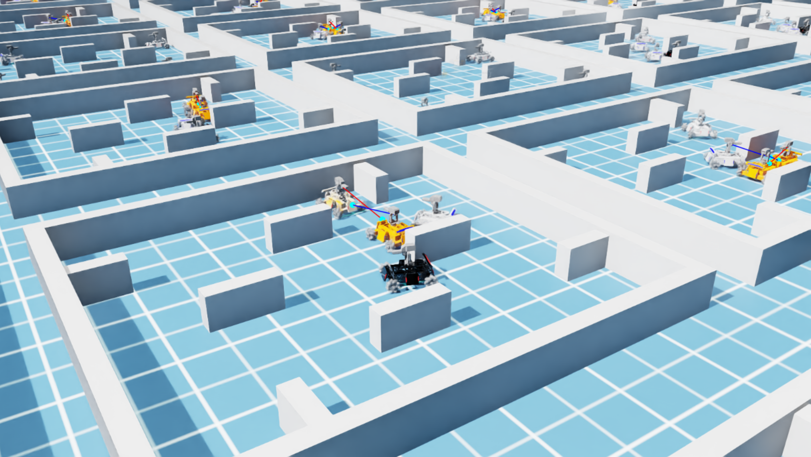

# ArenaSim

*ArenaSim* is a simulation platform designed for realistic and efficient self-play learning in multi-robot cooperative-competitive games. Built on [Nvidia Isaac Sim](https://docs.omniverse.nvidia.com/app_isaacsim/app_isaacsim/overview.html), *ArenaSim* supports fine-grained simulation to enhance realism and massive parallelism to accelerate learning. A benchmark of self-play algorithms is elaborated on *ArenaSim* to further inspire research on self-play learning in multi-robot scenarios.

## Installation

### 1. Install Isaac Sim
Follow the Isaac Sim [documentation](https://docs.omniverse.nvidia.com/isaacsim/latest/installation/install_workstation.html) to install Isaac Sim 4.0.0. 

### 2. Set PYTHON_PATH Variable
Add the following command to <code>~/.bashrc</code> to link to the python executable.

<code>alias PYTHON_PATH=~/.local/share/ov/pkg/isaac-sim-4.0.0/python.sh</code>

### 3. Install Dependencies
PYTHON -m pip install -r requirements.txt

## Quick Start
(1) To run self-play example

<code>PYTHON_PATH scripts/train.py train.params.algo.name=sp num_envs=16</code>

(2) To run ppo training example

<code>PYTHON_PATH scripts/train.py train.params.algo.name=ppo num_envs=16</code>

(3) To run mappo training example

<code>PYTHON_PATH scripts/train.py train.params.algo.name=mappo num_envs=16</code>

(4) To run self-play with massive parallelism

<code>PYTHON_PATH scripts/train.py train.params.algo.name=sp</code>

(5) To run in the headless mode

<code>PYTHON_PATH scripts/train.py train.params.algo.name=sp headless=True</code>

## Notes
The number of robots per team can be customized by modifying the parameter `NUM_ROBOTS_PER_TEAM` in the file `settings/constants_team.py`. This parameter determines the size of each team and affects both the simulation and training configurations. The suggested number of team size is 1 to 5.

## Acknowledgement
The repository is implemented based on [OmniIsaacGymEnvs](https://github.com/isaac-sim/OmniIsaacGymEnvs). The self-play part is based on [TimeChamber](https://github.com/inspirai/TimeChamber). The mecanum wheel model in this repository is sourced from [O3dynSimModel](https://git.openlogisticsfoundation.org/silicon-economy/simulation-model/o3dynsimmodel)

